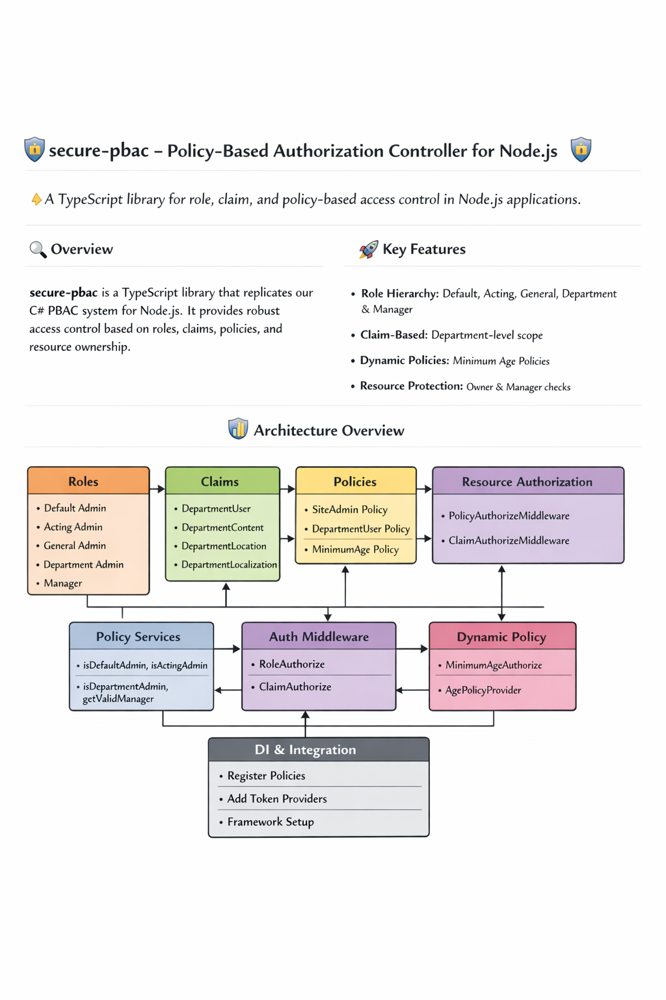

# secure-pbac (Policy-Based Authorization Controller for Node.js) 🛡️🔐

🔒 A TypeScript library for role, claim, and policy-based access control in Node.js applications.


---

## 🔍 Overview

`secure-pbac` is a TypeScript library that replicates our C# PBAC system for Node.js. It provides robust access control based on roles, claims, policies, and resource ownership.

---

## 🚀 Key Features

- Role Hierarchy: Default, Acting, General, Department & Manager  
- Claim-Based: Department-level scope  
- Dynamic Policies: Minimum Age Policies  
- Resource Protection: Owner & Manager checks  

---

## 📊 Architecture Overview

See the diagram below for a visual map of the PBAC authorization flow.



---

## 📦 Installation

```bash
npm install secure-pbac
```

---

## 🧱 Modules

- `roles/` → Role enums and utilities  
- `claims/` → Claim enums, types, priorities  
- `policies/` → PolicyEnum, GroupPolicyEnum, mapping logic  
- `services/` → PolicyAuthorizationService with async validation  
- `filters/` → Express/NestJS middleware for policy enforcement  
- `resource/` → ResourceManager and ResourceOwner handlers  
- `dynamic/` → MinimumAgeAuthorize and policy provider  
- `identity/` → SignIn claim management and token providers  
- `di/` → Registration helpers for DI frameworks  

---

## 🧪 Testing

- Jest + ts-mockito  
- Supertest for integration  
- 90%+ coverage goal  

---

## 🤝 Contributing

- Fork and clone  
- Run `npm install`  
- Follow commit conventions  
- See `[Looks like the result wasn't safe to show. Let's switch things up and try something else!]`  

---

## 📄 License

MIT


